[TOC]


# 0. 写在最前面

​	第0章将介绍如何让本次实验项目所编写的网站运行起来。

​	本次大作业网站已经在`Windows 10 1803`以及`Ubuntu 18.04 LTS`两种环境下运行测试通过。

## 0.1 准备工作

​	在`Windows 10 `下，用户首先需要安装Node JS以及NPM（一般在Windows下安装Node JS时会同时安装NPM）。此外还需要安装MySQL全套。MySQL Windows版本下载网址如下：

```http
https://dev.mysql.com/downloads/installer/
```

​	在`Linux`下则需要确保Node JS、NPM与MySQL包安装完成。

​	如果存在任何未安装的软件包，下列指令可供参考。

```bash
sudo apt install node-js
sudo apt install npm
sudo apt-get install mysql-server
sudo apt install mysql-client
sudo apt install libmysqlclient-dev
```

## 0.2 Node JS环境搭建

​	将本作业解压后，文件结构树如下：

```bash
└─MyWebsite
    ├─backend
    │  └─wordlist
    ├─css
    ├─doc
    ├─fonts
    │  └─roboto
    ├─images
    ├─js
    └─sqlScript
```

​	接下来需要使用NPM为本网站的后端安装MySQL驱动。

​	①`Windows`下运行`cmd.exe`（请使用管理员模式运行）后，使用`cd`命令进入到作业文件夹下。之后进入到`./backend`下后运行指令`npm install mysql`安装驱动；

​	②`Linux`下在bash中使用`cd`命令进入到作业文件夹下，之后进入到`./backend`下后运行指令`npm install mysql`安装驱动。

​	安装成功后在`./backend`下将会新出现一个名为`node_modules`的文件夹。

## 0.3 MySQL相关

​	 Linux下请在`bash`中使用`cd`命令进入`./sqlScript`目录。然后进入MySQL，执行下列指令：

```SQL
source create.sql;
```

​	运行后就可以在MySQL数据库中建立本次作业所需的database与user。

​	Windows下建议使用MySQL的GUI，将脚本中的内容复制到GUI内的`query`页面，然后执行查询（如下图所示，将SQL脚本复制到一个空白的query中，然后按下query按钮）。

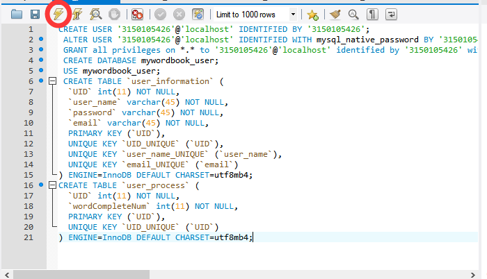

## 0.4 运行server

​	Linux下请在`bash`中使用`cd`命令进入`./backend`目录，然后运行命令`node server.js`，即可运行server。

​	Windows下使用`cmd.exe`在管理员模式下进入`./backend`目录，然后运行命令`node server.js`，即可运行server。

# 1. 使用手册

## 1.1 进入主页

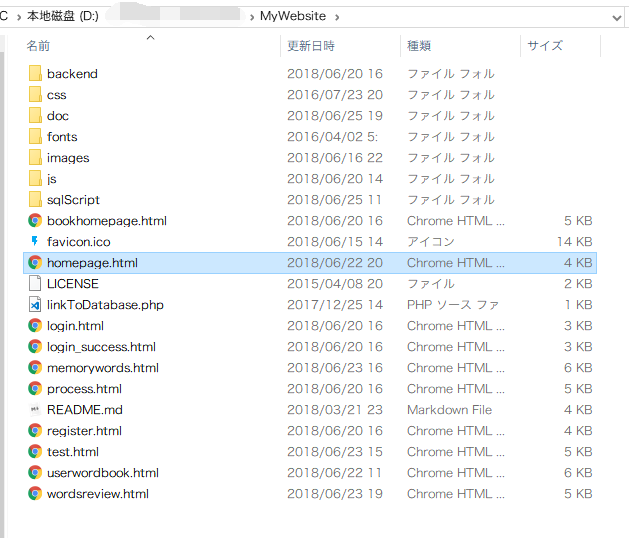	

​	双击打开`./`下的`homepage.html`，即可打开背单词网站的主页。主页界面如下图所示。


## 1.2 登陆与注册

​	在主页上按下开始`开始学习`按钮后，页面会自动跳转至登陆界面。


​	用户第一次使用该网站时，还未拥有本背单词网站的账户，所以需要点击下方`这里`的超链接进入注册页面。


​	用户必须使用一个在本网站没有注册过的用户名与一个没有在本网站注册过的邮箱进行新账号注册。

​	用户尝试在本网站注册过的用户名/邮箱注册时会受到错误提示。此外当3项任意一项为空时用户也会收到错误提示。

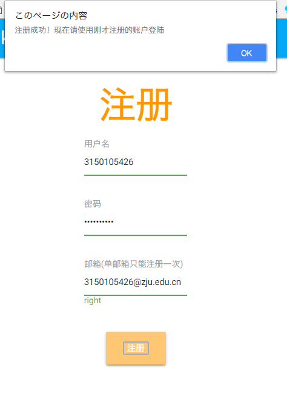

​	当成功注册时，用户会收到来自浏览器的弹窗成功提示。在按下弹窗提示的确定键/OK键后，页面会自动跳转回登陆界面。

​	在登陆界面用户需要输入用户名和对应的密码，输入完毕后按下橙色的`登陆`按钮。当用户名和密码存在于数据库中并且匹配时，页面将会跳转至用户主界面，否则将弹窗提示错误（具体的错误在弹窗中将会给出）。

## 1.3 用户主界面


​	上图为用户使用PC端大页面浏览器时显示的用户主界面。在用户使用PC端大页面的情况下，用户主界面会有一个侧边导览固定于页面左边（手机版+PC端小页面的状况稍有不同，将在下文叙述）。

​	下面将从上到下介绍侧边导览中的各个元素：

​	最上面的为头像与用户名。目前头像还只能固定使用默认的头像。用户名则会随着不同用户名发生相应的变化；

​	第一个选项为`单词背诵`（在其他页面则变为`返回选择单词本`）。由于用户主界面同时也是单词本的选择页面，因此在用户主界面点击本选项将不会发生任何变化；

​	第二个选项`自定义单词本`，用户按下后将跳转至用户自定义的单词本；

​	第三个选项`复习`，用户按下后将进入复习考核页面；

​	第四个选项`测试`，用户按下后将进入测试页面；

​	第五个选项`背诵概况`，用户按下后将进入单词本进度查看页面；

​	最后一个选项`退出登录`，用户按下后将退出登录，返回到主界面`./homepage.html`。

​	主界面中右侧部分为目前可用的固定单词本。按下开始背诵链接即可进入单词背诵页面。点击右侧详情按钮将显示此单词本的详细描述。

 

​	上面两张图为用户使用PC端小页面浏览器/手机端浏览器时显示的用户主界面。在此情况下，左侧的侧边导览默认将会隐藏，只有当点击左上角的menu按钮或是进行从左侧向右拖拽的操作，侧边导览才会从左侧弹出**（该特性符合作业要求5的要求：界面样式需要适配PC和手机的浏览器 ）**。在下文中，示意图将只会出现PC大页面浏览器。

## 1.4 单词背诵页面

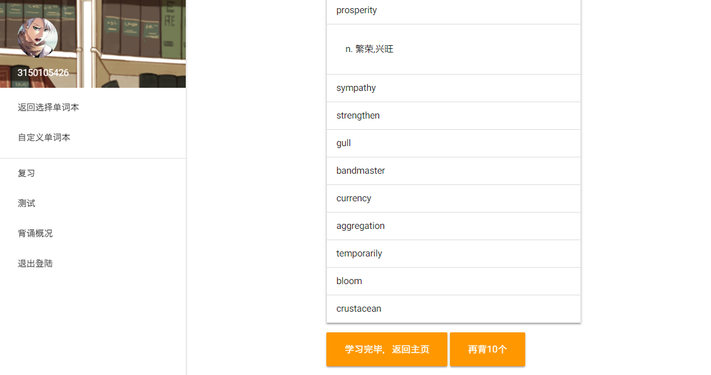

​	进入主页面后页面将自动跳出10个新单词（按照单词本文件内的顺序）。点击任意单词时将会显示该单词的中文意思，再次点击后将会合上。

​	当用户背完当前页面所有单词后，可以选择`学习完毕，返回主页`按钮返回主页。此时当前页面的单词将被视为已经背诵完毕的单词，系统将会把他们统计入进度条中。

​	如果用户本次单词学习有时间和精力余裕，可以选择`再背10个`按钮，此时页面将会先将本页的单词视为已背诵单词统计入进度条中，然后再次获取10个新的单词供用户背诵。

​	如果用户选择点击左侧侧边导览的任意选项，系统将不会把本页单词视为已背诵单词，而是直接跳转至其他功能页面。

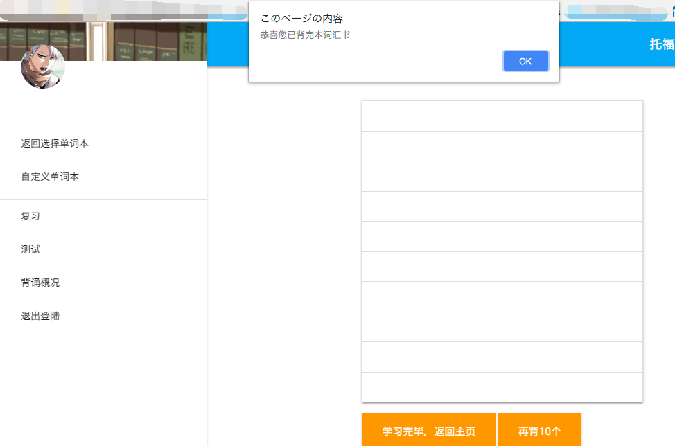

​	如果当前用户已经背完了该词汇书，那么用户在尝试进入单词背诵页面时将会收到弹窗提示。按下弹窗提示的确定键/OK键后页面自动返回用户主界面。（此外还有一种情况：当前页面恰好为该单词本最后10个单词，那么用户在按下`再背10个`按钮时也会收到该弹窗提示）

## 1.5 自定义单词本

​	在登陆后，用户点击任意界面的左侧侧边导览中的`自定义单词本`按钮即可进入本页面。

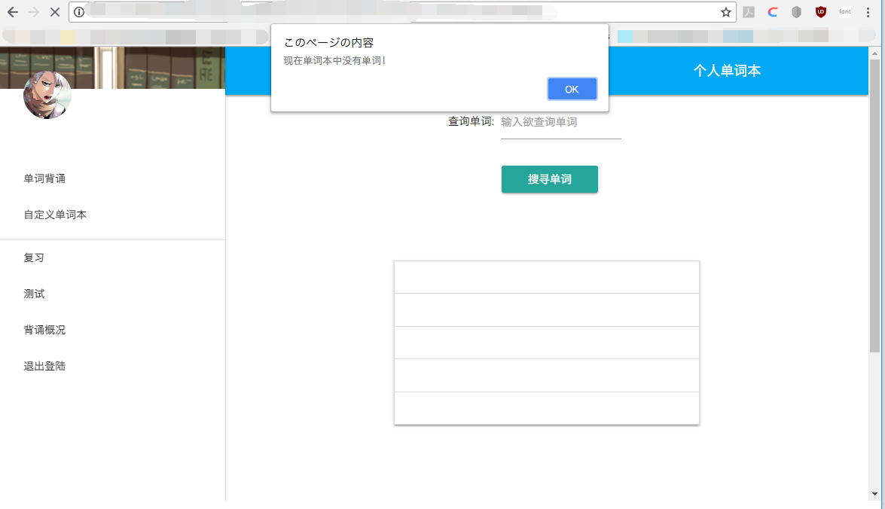

​	如果当前用户的自定义单词本中暂时没有任何单词，那么页面将会弹窗提示目前的单词本中没有任何单词。

​	用户可以在`输入欲查询单词`这一输入框中输入想要查询的单词（该单词必须在固定单词本中存在，否则用户将会收到“该单词在本单词本中不存在”的错误弹窗提示）。


​	当该单词存在于固定单词本中时，网页将会显示其中文释义，并且显示一个按钮`是否将该单词加入词汇本`。

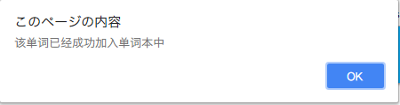

​	如果用户按下按钮`是否将该单词加入词汇本`，系统将会检测当前单词是否已经存在于单词本中。如果不存在则显示上图弹窗，否则显示下图弹窗。


​	在关闭弹窗后，页面将自动刷新，如果有单词成功添加入单词本那么在刷新后单词本将会更新。


## 1.6 复习

​	本功能的界面大致如下：


​	系统会从用户已经背诵完成的单词中 ，根据其背诵完成时间权重抽取10个单词进行测试。每个单词后都会给出4种可能的中文释义。用户需要从中选择他/她认为正确的中文释义。

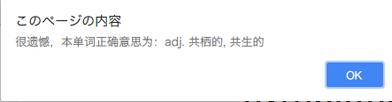

​	如果当前题目用户选择正确，系统将直接进入下一题，不会出现任何提示；当用户选择错误时，系统将发出弹窗，给出当前单词的正确意思，在弹窗关闭后系统进入下一题。


​	当用户回答完所有题目后，系统将会给出本轮复习的得分。按下`返回主页`页面将跳转至用户主界面。

​	用户在任何时候点击左侧的导览将直接退出本次复习测试并跳转至相应页面，测试进度将会丢失。

## 1.7 测试


​	测试界面与复习界面的风格完全相同。唯一的区别在于抽选的词汇范围。测试页面将会从整个单词本范围抽取单词对用户进行考核。

​	其他如错误提示、考核完成后的分数统计均与复习界面相同，不在此赘述。

## 1.8 背诵概况

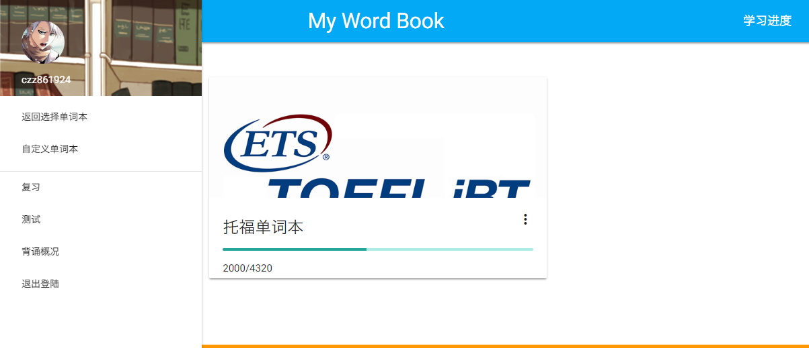

​	在本页面中，用户可以监视单词本的背诵进度，进而把控单词背诵进度。背诵进度将以数字和可视化进度条两种方式展现。

## 1.9 退出登录

​	用户按下`退出登录`选项将退出登陆并返回主界面。


# 2. 设计文档

## 2.1 数据库TABLE与底层数据结构

​	先来介绍数据库中的各个TABLE拥有哪些列以及该TABLE的作用。

​	在`mywordbook_user`该数据库中存放有本次大作业需要使用的所有TABLE。

​	Ⅰ. 在`mywordbook_user`被创建的同时，我们在其中新建了2张TABLE：`user_information`,`user_process`。

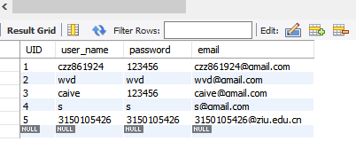

TABLE`user_information(int UID, varchar(255) user_name, varchar(255) password, varchar(255) email)`存放着所有已经在本背单词网站中注册的用户的UID、用户名、密码以及email地址。主键为UID，要求UID、用户名、email唯一。

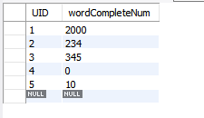

TABLE`user_process(int UID, int wordCompleteNum)`中存放着所有在本背单词网站中注册的用户的单词背诵进度。主键为UID；

​	Ⅱ. 在每个新用户注册的时候，server端收到注册请求核实为有效注册后就会向数据库新增两个表：

​		1.`用户名_book`；2. `用户名_worddate`；

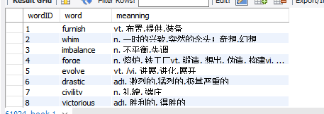

​	TABLE`用户名_book(int wordID, varchar(255) word, varchar(255) meanning)`中存储用户自定义的单词本。每个词都有一个唯一的`wordID`、拼写以及其对应的中文释义；

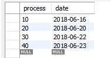

​	TABLE`用户名_worddate(int process, DATE date)`中存储着该用户每天的背诵进度。process代表其今日背诵的最后一个单词位于单词本中的第几位。

​	接下来介绍底层的数据结构。

​	底层有2个`mapobject`：`wordMapObj`，`word_ID_map`。

​       `wordMapObj`中存放着从服务器本地存放的JSON格式的单词本中读取的所有单词以及其对应中文释义。          

​       `word_ID_map`用于`wordID`到`word`的映射。

​	底层拥有3个Array，用于复习考核与测试考核：`testWordList[10]`，`testWordAns[10][4]`，`testRightAns[10]`（上述均为C语言表示）。

​       `testWordList[10]`用于存放系统筛选出的测试单词列表。

​       `testWordAns[10][4]`是个二维数组，用于存放每个考核单词对应的四个备选答案。

​       `testRightAns[10]`用于存放正确答案。

​	

## 2.2 主页设计

## 2.3 登陆与注册设计

## 2.4 用户主界面设计

## 2.5 单词背诵功能设计

## 2.6 复习功能设计

## 2.7 测试功能设计

## 2.8 背诵概况设计

